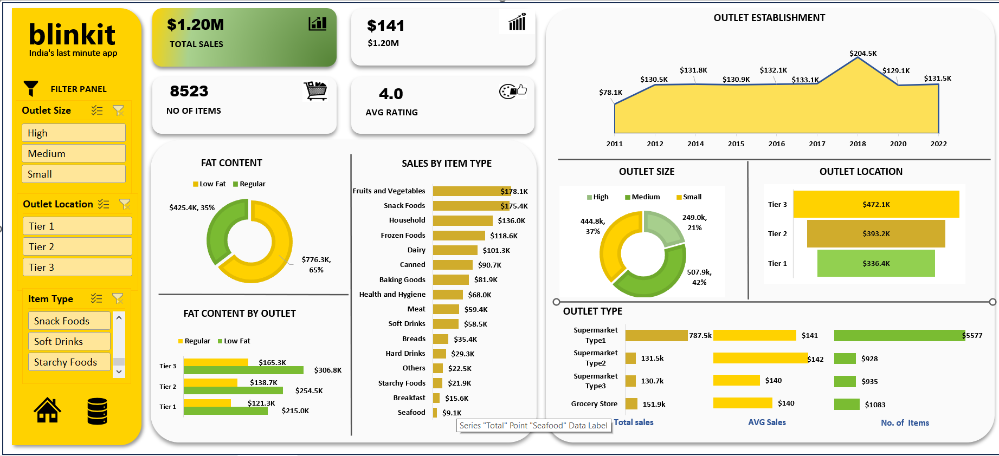

# Blinkit Excel Project

## Project Overview

This project presents a comprehensive Excel dashboard analyzing Blinkit's sales performance, outlet distribution, and product categories. The dashboard provides key insights and opportunities for optimization using various KPIs and visualizations.

## Key Performance Indicators (KPIs)

- **Total Sales**: Overall revenue generated from all items sold ($1.2M).
- **Number of Items Sold**: Total count of different items sold (8,523).
- **Average Rating**: Average customer rating for items sold (4.0 out of 5).
## Dashboard

https://github.com/user-attachments/assets/85bd5797-3066-4b71-a1f1-804ebf0d5387

## Features

- **Sales by Item Type**: Analysis of sales distribution across various product categories.
- **Sales by Fat Content**: Breakdown of sales between low-fat and regular-fat products.
- **Sales by Outlet Size**: Insights into sales performance based on outlet size (Small, Medium, High).
- **Sales by Location**: Examination of sales across different location tiers (Tier 1, Tier 2, Tier 3).
- **Top Performing Outlet Type**: Identification of the outlet type leading in revenue, with Supermarket Type 1 being the highest.

## Data Source

The analysis is based on the "BlinkIT Grocery Data Excel.xlsx" dataset, which includes detailed information on sales transactions, product details, outlet characteristics, and customer ratings.

## Insights

1. **Product Category Performance**: Certain product categories contribute significantly to total sales, indicating areas of strength and potential focus.
2. **Consumer Preferences**: The breakdown of sales by fat content reveals consumer inclinations towards specific product types.
3. **Outlet Performance**: Medium-sized outlets and those in Tier 3 locations exhibit notable sales figures, suggesting opportunities for targeted strategies.
4. **Outlet Type Success**: Supermarket Type 1 leads in revenue, highlighting its effectiveness in the current market setup.

## Conclusion

The dashboard offers a detailed view of Blinkit's operations, providing actionable insights to enhance sales strategies, optimize outlet performance, and better align with customer preferences.

